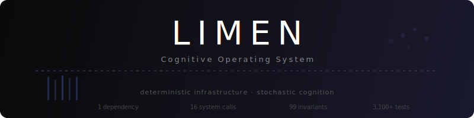

<p align="center">
  
</p>

<p align="center">
  <a href="https://www.npmjs.com/package/limen-ai"></a>
  <a href="https://github.com/solishq/limen/actions"></a>
  <a href="https://opensource.org/licenses/Apache-2.0"></a>
  <a href="https://nodejs.org/"></a>
  
  
</p>

---

# Limen

```typescript
import { createLimen } from 'limen-ai';
const limen = await createLimen();
const response = limen.chat('What is quantum computing?');
console.log(await response.text);
await limen.shutdown();
```

```bash
ANTHROPIC_API_KEY=sk-ant-... npx tsx examples/01-hello.ts
```

Set an API key environment variable. That is the only setup. `createLimen()` auto-detects your provider, generates a dev encryption key, and provisions a local SQLite database. Three lines to chat.

---

## What's Running Underneath

That three-line example is not a thin wrapper around an API call. When you ran it, the engine:

- **Created an AES-256-GCM encrypted SQLite database** with WAL mode and ACID transactions
- **Recorded an append-only, hash-chained audit entry** for every state mutation
- **Enforced RBAC authorization** on the operation
- **Tracked token usage and cost** against a budget ledger
- **Ran the request through circuit breakers and stall detection** over raw HTTP (no provider SDK)
- **Isolated your data by tenant** (single-tenant by default, multi-tenant by configuration)

None of this required configuration. The governance layer runs whether you configure it or not. The difference between the three-line demo and a production deployment is explicit configuration -- not a different code path.

---

## Why Limen Exists

Every serious AI application eventually builds the same infrastructure: conversation state management, token budget enforcement, provider failover, audit trails, structured output with retry, agent lifecycle control. Teams build these as ad-hoc layers on top of LLM SDKs, then spend months debugging the interactions between them.

Limen replaces that entire stack with a single engine. Provider communication happens through raw HTTP -- no SDKs, no transitive dependency trees, no version conflicts. State lives in a local SQLite database you control. Every mutation is audited atomically. Every agent operates within enforced budgets and capability boundaries.

The result: AI infrastructure with the reliability guarantees of a database engine and the operational simplicity of a single `npm install`.

The name is Latin for *threshold* -- the architectural boundary where deterministic infrastructure meets stochastic cognition.

---

## Progressive Examples

### Streaming

```typescript
const result = limen.chat('Explain how neural networks learn', { stream: true });
for await (const chunk of result.stream) {
  if (chunk.type === 'content_delta') process.stdout.write(chunk.delta);
}
```

Streaming and non-streaming produce identical final results (Invariant I-26).

### Structured Output

```typescript
const result = await limen.infer({
  input: 'List the top 3 programming languages by popularity',
  outputSchema: {
    type: 'object',
    properties: {
      languages: {
        type: 'array',
        items: {
          type: 'object',
          properties: { name: { type: 'string' }, reason: { type: 'string' } },
          required: ['name', 'reason'],
        },
      },
    },
    required: ['languages'],
  },
  maxRetries: 2,
});
console.log(result.data); // Typed, validated, guaranteed to match schema
```

### Sessions

```typescript
const session = await limen.session({
  agentName: 'tutor',
  user: { id: 'student-1', role: 'learner' },
});

session.chat('What is photosynthesis?');
session.chat('What role does chlorophyll play in it?'); // Sees prior context
session.chat('Summarize what we discussed');

const branch = await session.fork(2); // Fork at turn 2
branch.chat('What about artificial photosynthesis?');

await branch.close();
await session.close();
```

Context window is managed automatically -- including summarization when the window fills.

### Missions

```typescript
await limen.agents.register({
  name: 'researcher',
  capabilities: ['web', 'data'],
});

const mission = await limen.missions.create({
  agent: 'researcher',
  objective: 'Analyze the renewable energy market in Europe',
  constraints: {
    tokenBudget: 50_000,
    deadline: new Date(Date.now() + 3_600_000).toISOString(),
    capabilities: ['web', 'data'],
    maxTasks: 10,
  },
  deliverables: [
    { type: 'report', name: 'market-analysis' },
  ],
});

mission.on('checkpoint', (payload) => console.log('Checkpoint:', payload));
const result = await mission.wait();
```

Missions are budget-governed, deadline-enforced, and operate exclusively through the 16 system calls. The lifecycle transitions through: `CREATED` -> `PLANNING` -> `EXECUTING` -> `REVIEWING` -> `COMPLETED`.

See [`examples/`](examples/) for full runnable code.

---

## Trust Surface

Every claim in this section links to a proof document with file-and-line-number evidence. Every gap is declared.

| Claim | Status | Proof |
|---|---|---|
| 16 system calls | All Verified | [system-calls.md](docs/proof/system-calls.md) |
| 134 invariants across 3 tiers | 114 Verified, 1 Measured, 4 Implemented, 11 Declared, 4 Out of Scope | [invariants.md](docs/proof/invariants.md) |
| 21 failure mode defenses (of 45 specified) | 12 Verified, 8 Implemented, 1 Declared -- [24 have zero code presence](docs/proof/failure-modes.md) | [failure-modes.md](docs/proof/failure-modes.md) |
| 8 security mechanisms | All Verified at mechanism level -- [25 declared non-protections](docs/proof/security-model.md) | [security-model.md](docs/proof/security-model.md) |

Full evidence summary, including an explicit "What Is NOT Proven" section: [readiness.md](docs/proof/readiness.md).

Evidence classes: **Verified** = source enforcement + meaningful tests. **Implemented** = source enforcement, weak/no tests. **Measured** = quantitative measurement with threshold. **Declared** = spec/documentation only. **Out of Scope** = not applicable to current version.

---

## Architecture

Limen is built as four layers, each with a strict dependency direction: down only, never up.

```
┌─────────────────────────────────────────────┐
│  API Surface                                │  createLimen(), chat(), infer(),
│  Public interface. Composes everything.      │  sessions, agents, missions, health
├─────────────────────────────────────────────┤
│  Orchestration                              │  Missions, task graphs, budgets,
│  Cognitive governance. 16 system calls.      │  checkpoints, artifacts, events
├─────────────────────────────────────────────┤
│  Substrate                                  │  LLM gateway, transport engine,
│  Execution infrastructure.                   │  worker pool, scheduling, adapters
├─────────────────────────────────────────────┤
│  Kernel                                     │  SQLite (WAL), audit trail, RBAC,
│  Persistence and trust.                      │  crypto, events, rate limiting
└─────────────────────────────────────────────┘
```

**Kernel** owns persistence, identity, and trust. SQLite in WAL mode provides ACID transactions. An append-only, hash-chained audit trail records every state mutation. RBAC enforces authorization on every operation. AES-256-GCM encrypts sensitive data at rest. The kernel has zero knowledge of AI -- it is pure infrastructure.

**Substrate** provides execution services. The transport engine communicates with LLM providers over raw HTTP with circuit breakers, exponential backoff, streaming with stall detection, and TLS enforcement. A worker pool with resource limits manages concurrent execution. No provider SDK is imported -- ever.

**Orchestration** is where cognition meets governance. Agents propose missions, task graphs, artifact creation, budget requests, and checkpoint responses through 16 formally defined system calls. The orchestration layer validates every proposal before any state mutation occurs. This is the governance boundary: intelligence proposes, infrastructure decides.

**API Surface** composes these layers into the public `Limen` object. A single factory call -- `createLimen(config)` -- wires kernel, substrate, and orchestration into a frozen, immutable engine instance.

---

## Providers

Six providers, zero SDKs. All communication is raw HTTP via `fetch`.

| Provider | Adapter Factory | Streaming | Auth |
|---|---|---|---|
| **Anthropic** | `createAnthropicAdapter(apiKey, baseUrl?)` | SSE | Bearer token |
| **OpenAI** | `createOpenAIAdapter(apiKey, baseUrl?)` | SSE | Bearer token |
| **Google Gemini** | `createGeminiAdapter(apiKey, baseUrl?)` | SSE | Query param |
| **Groq** | `createGroqAdapter(apiKey, baseUrl?)` | SSE | Bearer token |
| **Mistral** | `createMistralAdapter(apiKey, baseUrl?)` | SSE | Bearer token |
| **Ollama** | `createOllamaAdapter(baseUrl?)` | NDJSON | None (local) |

Each provider also has a `*FromEnv()` variant that reads the API key from the environment (`ANTHROPIC_API_KEY`, `OPENAI_API_KEY`, `GEMINI_API_KEY`, `GROQ_API_KEY`, `MISTRAL_API_KEY`). Ollama runs locally and requires no authentication.

Configure multiple providers at the engine level:

```typescript
const limen = await createLimen({
  dataDir: './data',
  masterKey: Buffer.from(process.env.LIMEN_MASTER_KEY!, 'hex'),
  providers: [
    {
      type: 'anthropic',
      baseUrl: 'https://api.anthropic.com',
      models: ['claude-sonnet-4-20250514'],
      apiKeyEnvVar: 'ANTHROPIC_API_KEY',
      maxConcurrent: 5,
    },
    {
      type: 'openai',
      baseUrl: 'https://api.openai.com',
      models: ['gpt-4o'],
      apiKeyEnvVar: 'OPENAI_API_KEY',
    },
    {
      type: 'ollama',
      baseUrl: 'http://localhost:11434',
      models: ['llama3.2'],
    },
  ],
});
```

---

## How Limen Compares

*As of March 2026. Limen is a new project with near-zero community adoption. Vercel AI SDK and LangChain are mature ecosystems with large communities, extensive integrations, and production deployment track records that Limen does not have.*

|  | Limen | Vercel AI SDK | LangChain.js |
|---|---|---|---|
| **Production deps** | 1 | ~50+ | ~50+ |
| **Provider communication** | Raw HTTP (no provider SDKs) | Provider SDK packages (`@ai-sdk/*`) | Provider SDK packages (`@langchain/*`) |
| **Built-in persistence** | SQLite (WAL, local) | No | Optional (external DB) |
| **Audit trail** | Hash-chained, append-only | No | LangSmith (paid SaaS) |
| **Budget enforcement** | Per-mission token budgets | No | No |
| **Agent governance** | 16 system calls, RBAC | No | No |
| **Multi-tenant isolation** | Row-level or database-level | No | No |
| **Encryption at rest** | AES-256-GCM (per-field vault) | No | No |
| **Streaming** | SSE/NDJSON with stall detection and timeouts | SSE | SSE |
| **Structured output** | JSON Schema + auto-retry | Zod schemas | Output parsers |

Limen occupies a different architectural position than these tools. Vercel AI SDK is an excellent lightweight interface for LLM communication. LangChain provides a broad ecosystem of integrations, agents, and retrieval patterns. Limen is an operating system for agent governance -- it enforces boundaries, tracks budgets, audits mutations, and isolates tenants. If your primary need is calling an LLM or composing a retrieval pipeline, those tools are more appropriate. If your primary need is enforced governance over agent behavior with full auditability, that is what Limen was built for.

---

## Three Export Paths

Limen ships three independent entry points. Use the full engine, the reference agent, or the transport layer alone.

### `limen-ai` -- The Engine

The complete Cognitive OS. Everything described in this document.

```typescript
import { createLimen } from 'limen-ai';
import type { Limen, LimenConfig, ChatResult } from 'limen-ai';
```

### `limen-ai/reference-agent` -- Mission Agent

A proof-of-architecture agent that demonstrates how to build on the 16 system calls. It decomposes objectives into task graphs, manages budgets, handles checkpoints, aggregates artifacts, and delegates sub-missions. It interacts with the engine exclusively through the public API -- it cannot reach kernel or substrate internals.

```typescript
import { createReferenceAgent } from 'limen-ai/reference-agent';

const agent = createReferenceAgent(limen, {
  name: 'analyst',
  decompositionStrategy: 'heuristic',
  capabilities: ['web', 'data'],
});

const result = await agent.runMission({
  objective: 'Analyze competitive landscape for drone delivery in Southeast Asia',
  constraints: {
    tokenBudget: 50_000,
    deadline: '2026-12-31T23:59:59Z',
    capabilities: ['web', 'data'],
  },
});
```

### `limen-ai/transport` -- Standalone LLM Client

The transport layer works independently of the engine. Zero-dependency LLM communication with circuit breakers, retry with exponential backoff, streaming with stall detection, response size limits, TLS enforcement, and graceful shutdown. If you need a reliable way to talk to LLM providers without pulling in their SDKs, this is it.

```typescript
import {
  createTransportEngine,
  createAnthropicAdapterFromEnv,
  createOpenAIAdapterFromEnv,
} from 'limen-ai/transport';

const engine = createTransportEngine();
const anthropic = createAnthropicAdapterFromEnv();

// Non-streaming with automatic retry (3 attempts, 120s cap)
const result = await engine.execute(anthropic, {
  request: {
    model: 'claude-sonnet-4-20250514',
    messages: [{ role: 'user', content: [{ type: 'text', text: 'Hello' }] }],
    maxTokens: 1024,
  },
});
console.log(result.response.content);

// Streaming with stall detection (30s first-byte, 30s stall, 10min total)
const stream = await engine.executeStream(anthropic, {
  request: {
    model: 'claude-sonnet-4-20250514',
    messages: [{ role: 'user', content: [{ type: 'text', text: 'Hello' }] }],
    maxTokens: 1024,
  },
});
for await (const chunk of stream.stream) {
  // Process LlmStreamChunk
}

engine.shutdown(); // Aborts in-flight, rejects new requests
```

---

## The 16 System Calls

Every agent interaction with the engine passes through exactly 16 system calls. This is the governance boundary. Agents propose; the system validates and executes.

**Orchestration** -- mission lifecycle and task governance:

| # | Call | What It Does |
|---|---|---|
| SC-1 | `propose_mission` | Create a mission with objective, budget, and deadline |
| SC-2 | `propose_task_graph` | Submit a DAG of tasks with dependency edges |
| SC-3 | `propose_task_execution` | Request execution of a validated task |
| SC-4 | `create_artifact` | Produce a versioned, immutable artifact |
| SC-5 | `read_artifact` | Retrieve an artifact by ID and version |
| SC-6 | `emit_event` | Signal a domain event (lifecycle events are system-only) |
| SC-7 | `request_capability` | Execute a capability (web, code, data, file, API) |
| SC-8 | `request_budget` | Request additional token budget with justification |
| SC-9 | `submit_result` | Deliver final results with confidence score |
| SC-10 | `respond_checkpoint` | Answer a system checkpoint with assessment |

**Claim Protocol** -- structured knowledge with provenance:

| # | Call | What It Does |
|---|---|---|
| SC-11 | `assert_claim` | Assert a knowledge claim with evidence and confidence score |
| SC-12 | `relate_claims` | Create typed relationships between claims |
| SC-13 | `query_claims` | Query claims by subject, predicate, mission, or artifact |

**Working Memory** -- task-scoped ephemeral state:

| # | Call | What It Does |
|---|---|---|
| SC-14 | `write_working_memory` | Write key-value entries to task-local scratch space |
| SC-15 | `read_working_memory` | Read entries or list all keys in task-local memory |
| SC-16 | `discard_working_memory` | Discard entries from task-local memory |

An agent cannot bypass these calls. It cannot write to the database, emit lifecycle events, modify its own capabilities, or mutate completed artifacts. The system call boundary is structural, not conventional -- enforced by the type system and the layer architecture.

---

## Configuration Reference

```typescript
interface LimenConfig {
  dataDir: string;                           // Where all engine state lives
  masterKey: Buffer;                         // >= 32 bytes, for AES-256-GCM encryption
  providers?: ProviderConfig[];              // LLM provider configurations
  tenancy?: {
    mode: 'single' | 'multi';               // Default: 'single'
    isolation?: 'row-level' | 'database';    // Multi-tenant isolation strategy
  };
  substrate?: {
    maxWorkers?: number;                     // Worker pool size (default: 4)
    schedulerPolicy?: 'deadline' | 'fair-share' | 'budget-aware';
  };
  offline?: {                                // Offline/disconnected operation (S30)
    embeddings?: boolean;                    // Enable local embedding cache
    queueSize?: number;                      // Offline operation queue size
    syncOnReconnect?: boolean;               // Auto-sync when connectivity returns
  };
  hitl?: HitlConfig;                         // Human-in-the-loop defaults
  safety?: {                                 // Safety gate configuration (DL-5)
    enabled?: boolean;                       // Enable pre/post-safety gates (default: true)
    jitterEnabled?: boolean;                 // Add jitter to safety timing
  };
  defaultTimeoutMs?: number;                 // Chat/infer timeout (default: 60000)
  rateLimiting?: {
    apiCallsPerMinute?: number;              // Default: 100
    emitEventPerMinute?: number;             // Event emission rate limit
    maxConcurrentStreams?: number;            // Default: 50
  };
  failoverPolicy?: 'degrade' | 'allow-overdraft' | 'block';  // Provider failure behavior (FM-12)
  logger?: (event: LimenLogEvent) => void;  // Structured logging callback
}
```

All fields except `dataDir` and `masterKey` are optional. When `createLimen()` is called with no arguments, provider detection, key generation, and data directory are resolved automatically from environment variables. See [getting-started.md](docs/getting-started.md) for details.

---

## Quick Start Paths

### Demo (zero-config)

```bash
npm install limen-ai
export ANTHROPIC_API_KEY=sk-ant-...  # or OPENAI_API_KEY, GEMINI_API_KEY, etc.
npx tsx examples/01-hello.ts
```

Auto-detects provider, generates a dev encryption key (`~/.limen/dev.key`), stores data in OS temp directory. No configuration file needed.

### Production (explicit config)

```typescript
import { createLimen } from 'limen-ai';

const limen = await createLimen({
  dataDir: '/var/lib/myapp/limen',
  masterKey: Buffer.from(process.env.LIMEN_MASTER_KEY!, 'hex'),
  providers: [{
    type: 'anthropic',
    baseUrl: 'https://api.anthropic.com',
    models: ['claude-sonnet-4-20250514'],
    apiKeyEnvVar: 'ANTHROPIC_API_KEY',
  }],
  tenancy: { mode: 'multi', isolation: 'row-level' },
});
```

> **Master key management:** The `masterKey` is used for AES-256-GCM encryption at rest. If you lose the key, encrypted data becomes permanently unreadable. Generate once, store securely:
>
> ```bash
> node -e "console.log(require('crypto').randomBytes(32).toString('hex'))" > master.key
> chmod 600 master.key
> ```
>
> Keep the key out of version control. Rotate by re-encrypting: create a new engine instance with the new key and migrate data through the public API.

See [getting-started.md](docs/getting-started.md) for the full walkthrough.

---

## Invariant System

Limen defines 134 invariants across 3 tiers. 114 are Verified (source enforcement with dedicated tests), 1 Measured, and 19 carry lower evidence classes — see the [full evidence index](docs/proof/invariants.md). A violation of any enforced invariant is a system defect.

| Invariant | Guarantee |
|---|---|
| **I-01** | Single production dependency (`better-sqlite3`) |
| **I-02** | User owns all data. Export and delete at any time. |
| **I-03** | Every state mutation includes its audit entry in the same transaction |
| **I-04** | Provider independence. Swap providers without code changes. |
| **I-05** | All multi-step mutations are transactional |
| **I-06** | Audit trail is append-only and hash-chained. Cannot be modified or deleted. |
| **I-07** | Multi-tenant isolation at row or database level |
| **I-11** | Encryption at rest (AES-256-GCM) |
| **I-13** | Authorization checked on every operation (RBAC completeness) |
| **I-17** | Governance boundary: agent output never directly mutates state |
| **I-19** | Artifacts are immutable after creation. Version, never modify. |
| **I-20** | Mission trees are bounded (depth 5, children 10, total 50) |
| **I-24** | Every task graph requires objective alignment proof |
| **I-25** | Deterministic replay: record LLM outputs, replay to identical state |
| **I-26** | Streaming and non-streaming produce identical results |
| **I-28** | Pipeline phases execute in fixed, deterministic order |

These invariants are what make AI infrastructure trustworthy. When your agent runs a mission overnight, I-03 guarantees you can audit every action it took. I-17 guarantees it never bypassed the governance layer. I-20 guarantees it did not spawn an unbounded tree of sub-missions. I-19 guarantees no artifact was silently modified after creation.

---

## Observability

```typescript
// Health: three-state (healthy, degraded, unhealthy)
const health = await limen.health();
console.log(health.status);           // 'healthy' | 'degraded' | 'unhealthy'
console.log(health.uptime_ms);
console.log(health.subsystems);       // Per-subsystem status
console.log(health.throughput);       // requests/s, active streams, error rate

// Metrics: structured snapshot
const metrics = limen.metrics.snapshot();
console.log(metrics.limen_requests_total);
console.log(metrics.limen_tokens_cost_usd);
console.log(metrics.limen_audit_chain_valid);
console.log(metrics.limen_db_size_bytes);
```

Health distinguishes between three states: **healthy** (all subsystems operational, LLM providers reachable), **degraded** (engine functional but LLM connectivity impaired), and **unhealthy** (critical subsystem failure). Subsystem health covers database, audit, providers, sessions, missions, learning, and memory.

---

## Error Handling

Every error thrown by Limen is a `LimenError` with a typed code, a human-readable message, a `retryable` flag, and an optional `cooldownMs` for rate-limited responses.

```typescript
import { LimenError } from 'limen-ai';

try {
  const result = limen.chat('Hello');
  await result.text;
} catch (err) {
  if (err instanceof LimenError) {
    console.log(err.code);       // 'RATE_LIMITED' | 'TIMEOUT' | 'PROVIDER_UNAVAILABLE' | ...
    console.log(err.retryable);  // true for transient errors
    console.log(err.cooldownMs); // Present for RATE_LIMITED
  }
}
```

Error codes trace directly to specific system behaviors: `BUDGET_EXCEEDED` from budget enforcement, `CAPABILITY_VIOLATION` from the governance layer, `SCHEMA_VALIDATION_FAILED` from structured output, `PROVIDER_UNAVAILABLE` from the transport engine. Internal details -- stack traces, SQL errors, file paths -- are never exposed through the public API.

---

## Development

```bash
git clone https://github.com/solishq/limen.git
cd limen
npm install

npm run typecheck    # TypeScript strict mode, zero errors
npm run build        # Compile to dist/
npm test             # Full test suite (2,447+ tests)
npm run ci           # typecheck + build + test
```

### CI Enforcement

The CI pipeline enforces structural properties on every push:

- **Single dependency** -- exactly one production dependency (`better-sqlite3`)
- **No `@ts-ignore`** -- every type must be resolved
- **No uncontrolled `any`** -- type safety is not optional
- **No decorative assertions** -- tests that pass regardless of implementation are rejected
- **Forward-only migrations** -- existing migration files cannot be modified
- **Node.js 22 and 24** -- tested on current and next LTS

---

## Contributing

See [CONTRIBUTING.md](CONTRIBUTING.md) for development setup, architecture overview, and pull request requirements.

## Security

Report vulnerabilities privately. See [SECURITY.md](SECURITY.md) for details.

## License

[Apache License 2.0](LICENSE)

---

<p align="center">Built by <a href="https://solishq.ai">SolisHQ</a></p>
